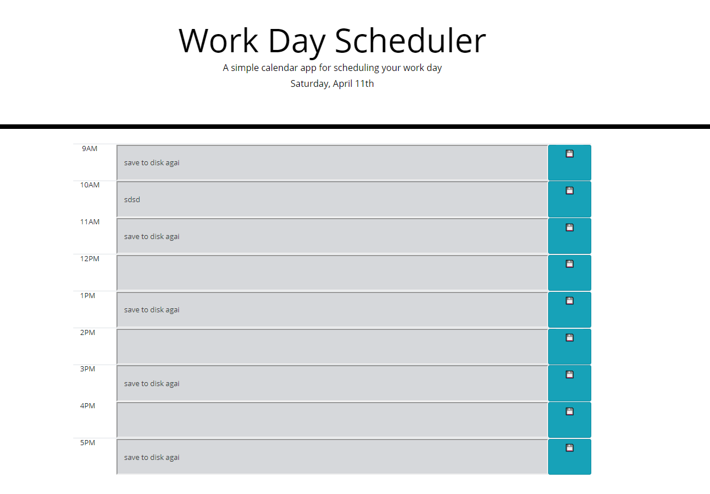

# Module 5-Assignment
# Daily Calendar
# Assignment is to create a calendar color coded by time that updates saved tasks when the page is refreshed.
# Link to deployed application:    https://dancl6.github.io/Daily-Scheduler/

